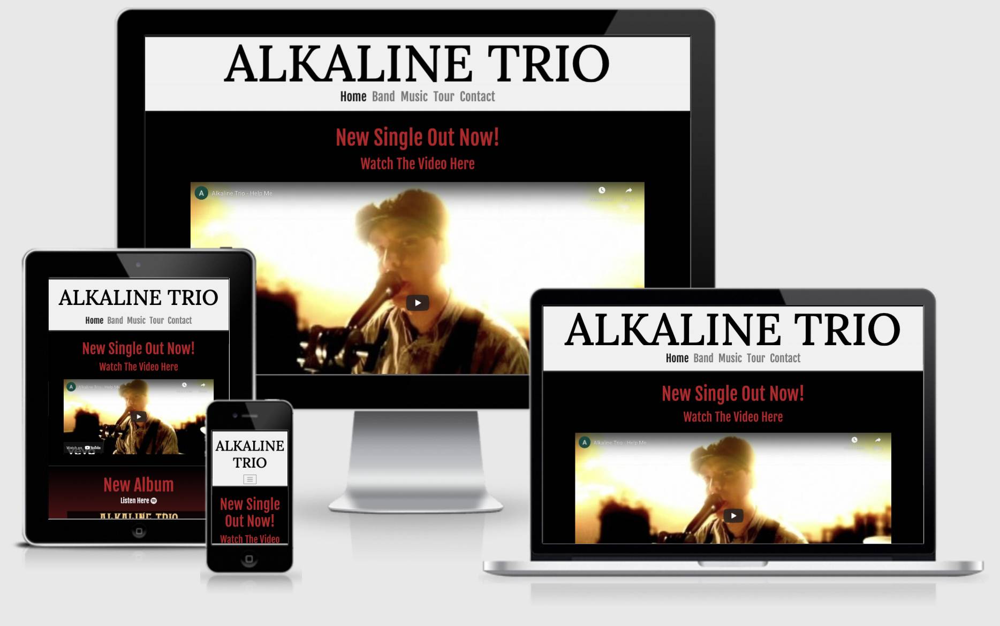
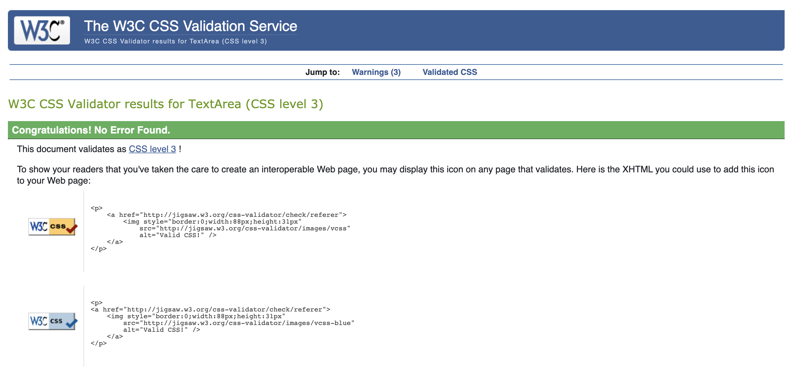

# Milestone Project One | Alkaline Trio Website

 

[View the live project here](https://ashb87.github.io/Alkaline-Ms-Project-one/)  
This website has been created for my Milestone 1 User Centric Frontend Development project.  
I want to create a site for current and potential fans of the band **__Alkaline Trio,__** that is responsive to different sceen sizes,
easy to navigate and pleasing to use for the site visitor. 

## Contents 

 * [User Experience](#user-experience-(ux))
   - [Site Goals](#site-goals)
   - [User Stories](#user-stories)
   - [Design](#design)
     - [Color Scheme](#color-scheme)
     - [Typography](#typography)
     - [Imagery](#imagery)
     - [Wireframes](#wireframes)

 * [Features](#features)
   - [Current Features](#across-all-pages) 
   - [Features to implement in the future](#features-i-would-like-to-implement)

 * [Technologies Used](#technologies-used)  

 * [Testing](#testing)
   - [Testing User Stories and Site Goals](#testing-user-stories-and-site-goals)
   - [Responsive Testing](#responsive-testing)
   - [HTML & CSS Testing](#html-and-css-testing)
   - [Further Testing](#further-testing)
   - [Known issues & Bugs](#known-Issues-and-bugs)

 * [Deployment](#deployment)  

 * [Credits](#credits)

## User Experience - (UX)

### Site Goals

  - #### Site owner/band Goals
    1. I want the site to be attractive, responsive and easy to navigate for the user.
    2. I want the site to clearly promote who the band are.
    3. I want the user to be able to find the bands social platforms via links in the website.
    4. I want to give the user the oppurtunity to watch vides and listen to music by the band.
    5. I want to promote any upcoming tour dates with the option to book tickets through the site.
    6. I want the user to be able to sign up to news and updates and also be able to contact us.
    7. I want to promote any new singles or albums the band have released.

### User Stories

  * #### First Time Visitor Goals 
    1. As a first time visitor I Want to understand clearly who the site is for.
    2. As a first time visitor I want the site to be responsive to which ever device I am using to visit it.
    3. As a first time visitor I want to easily navigate around the site to find my desired page.
    4. As a first time visitor I want the site to be visually attractive and easy to read all content on every page.

  * #### Returning Visitor Goals
    1. As a returning visitor I want to see any new video or music content the band have released.
    2. As a returning visitor I want to be able to check for upcoming live shows and book tickets via the website.
    3. As a returning visitor I want to see social media links so I can follow the band on other platforms.
    4. As a returning visitor I would like to read information about the band, so I can learn a little about their history and the current members. 

  * #### Frequent Visitor Goals
    1. As a frequent visitor I want to see any new video or music content the band have released.
    2. As a frequent visitor I would like to be kept up to date with any news or information regarding the band.
    3. As a frequent visitor I would like the option to be able to contact the band.
    4. As a frequent visitor I would like to be able to listen to the bands music on the website.        

### Design

I want the design of the website to reflect the band and their style and so will choose colors that compliment this well. It should be easy 
to navigate and to have a clear meaning to each page of the site. 
I want to keep a consistent theme throughout the website by using the same color combinations on every page but also making each page slightly
unique by changing which colors are used where. For example background and heading colors. I want the site to be attractive for the user and make
them want to return ot the site again.

  * #### Color scheme
     * The main colors I have used in this project are a shade of red (#ba1626), black and gold (#d3ab78) and also a slightly off white (#f0f0f0).
       I chose these colors because the band have often used a black and red theme for album covers, and the newest album also incorporates
       gold. I chose the off white for the header element and also the background color for the history section on the band page
       because I found it made the paragraphs of text easy to read and also contrasts nicely with the rest of the page as a header. 
     * Both the red and gold shades were found using the color selector on chrome dev tools. I used the selector to find the correct shade of each color
       that I felt complimented the site well.

  * #### Typography
     * The two fonts I have used are *Fjalla One* and *Lora*. Both fonts have been imported from google fonts. I have used *sans-serif* as a backup 
       font incase the other two for some reason don't load correctly with the site.
     * I used Lora for the header font and also the paragraphs of text in the history section of the band page. Fjalla One was used for everything else.
     * I picked these fonts because Lora is a clear and easy to read font so works well for the larger blocks of text and also had the look I wanted for the 
       header when typed in all capitals. I then picked Fjalla One because I think the two fonts compliment each other nicely and look attractive
       togehter on the site.

  * #### Imagery
     * The images I have used for this project are to enhance the visual aspect of the specific page they are related to. The band page with information
     about the band members and their history has various pictures of the members either on their own or all together. The music page has
     an image of each of the album covers listed on that page. For the tour page I have used an image for the background of the band playing
     at a live show. For larger screens the image is displayed just once, for mobile devices the image is repeated as you scroll down the screen.
     I decided to do this rather than no-repeat because the image looked way too stretched and the bottom and top blend very well together giving it 
     a very natural look for small screen viewing.

  * #### Wireframes

To make my wireframes I have used balsamiq. I did one for each page and did a design for larger screens and smaller screens to show how the 
site will be responsive to screen size and change accordingly. The links to each one are below.  **__For easier viewing I would recommend clicking the 
dowload button above the wireframe image as they appear much larger when viewed directly through github__**

* [Home page (md, lg, xl screens)](https://github.com/Ashb87/Alkaline-Ms-Project-one/blob/master/MS1-wireframes/Alkaline-project-home-big.png)
* [Home page (sm, xs screens)](https://github.com/Ashb87/Alkaline-Ms-Project-one/blob/master/MS1-wireframes/Alkaline-project-home-small.png)
* [Band page (md, lg, xl screens)](https://github.com/Ashb87/Alkaline-Ms-Project-one/blob/master/MS1-wireframes/Alkaline-project-band-big.png)
* [Band page (sm, xs screens)](https://github.com/Ashb87/Alkaline-Ms-Project-one/blob/master/MS1-wireframes/Alkaline-project-band-small.png)
* [Music page (md, lg, xl screens)](https://github.com/Ashb87/Alkaline-Ms-Project-one/blob/master/MS1-wireframes/Alkaline-project-music-big.png)
* [Music page (sm, xs screens)](https://github.com/Ashb87/Alkaline-Ms-Project-one/blob/master/MS1-wireframes/Alkaline-project-music-small.png)
* [Tour page (md, lg, xl screens)](https://github.com/Ashb87/Alkaline-Ms-Project-one/blob/master/MS1-wireframes/Alkaline-project-tour-big.png)
* [Tour page sm, xs screens)](https://github.com/Ashb87/Alkaline-Ms-Project-one/blob/master/MS1-wireframes/Alkaline-project-tour-small.png)
* [Contact page (md, lg, xl screens)](https://github.com/Ashb87/Alkaline-Ms-Project-one/blob/master/MS1-wireframes/Alkaline-project-contact-big.png)
* [Contact page (sm, xs screens)](https://github.com/Ashb87/Alkaline-Ms-Project-one/blob/master/MS1-wireframes/Alkaline-project-contact-small.png)

I mostly kept the design of the website very similar to that of my wireframes. I decided to change the navbar and only use the burger icon for the 
smaller screen devices because I preferred the look of having each page link available to see in the header on larger screens. I also centered
the social links at the bottom of the page with the sign up button above, on all screen sizes rather than just mobile devices.
The biggest change I made was to the music page. I decided to give each album its own row across the whole screen rather than have three side by side
as I did in the wireframes. I chose to do this because I wanted to get the image, text and music player for each album on the screen without it feeling
too squashed or crowded.

## Features

  * ### Across all pages
    * Responsive design for different screen sizes while maintaining a clear and attractive layout across all pages.

  * ### Header and Footer - consistent on all pages
    * Responsive Navbar that collapses to a burger icon for smaller screens.
    * A sign up button that when clicked displays a modal with a form to fill in for users of the site to recieve news and updates about the band.
      Currently due to the scope of the project, when the form is submitted nothing will happen.
    * Social media links for the band, including **Facebook**, **Twitter**, **YouTube** and **Instagram** These will open a new page and link 
      to the bands actual social media pages.

  * ### Home page
    * A video using embedded code from YouTube for one of the bands singles.
    * An image promoting the new album with a link directing the user to this album on the spotify website.
    * A link giving the user the option to follow the band on spotify.

  * ### Band page
    * An image of each of the band members with their date of birth and which instrument the play
    * A history section about the band with images and text giving information on the history of the bands lineup changes and albums produced.

  * ### Music page
    * A section for six of the bands albums, each section inlcuding a picture of the album cover, the title and release year, and an audio
      card for each album with controls. These include all the tracks for each album, which allows the user to listen to the albums as they please. 

  * ### Tour page
    * A background image of the band playing live intended to add excitement when buying tickets for one of their concerts.
    * Tour dates with city, venue and opening times, with either a *book now* or *sold out* button.
    * The book now button will direct the user to the ticketmaster home page.
    * The sold out button is deactivated and can not be clicked.

  * ### Contact page
    * A form allowing the user to contact the band with a direct message, each field must be filled in before clicking the submit button.
      Due to the scope of this project, when the form is submitted nothing will happen.  
      
## Features I would like to implement 
With the addition of javascript and knowledge of back-end web development I would like to add these further features to the website.
  * When a user signs up with the sign up form on screen they would receive a welcome email and then be included in all future emails 
    for news and updates regarding the band. 
  * When a user fills in the contact form the message would be sent to an email address for the band and management to see allowing a response 
    and or reply.
  * The tour page would be used for a genuine tour with users being able to book their tickets directly through the website, and the buttons 
    changing from *book now* to *sold out* when all the tickets were gone.
  * A page for merchandise where users could browse items, add to a basket and pay for their items through the website. Followed up by a 
    confirmation of purchase email being sent to the user. 

## Technologies Used
   ### Languages used

  * [HTML5](https://developer.mozilla.org/en-US/docs/Web/Guide/HTML/HTML5)  
     The project uses HTML5 to make up the basic elements and structure of the website.
  * [CSS3](https://developer.mozilla.org/en-US/docs/Web/CSS)  
     I have used CSS3 to add my own custom styling and to change any default bootstrap styling that didn't fit with the look of the website.
  
  ### Frameworks, Libraries and Programs Used
  * [Balsamiq](https://balsamiq.com/)  
     I used balsamiq to design and draw up my wireframes before starting the project.
  * [Bootstrap](https://getbootstrap.com/)  
     The Bootstrap framework was used to help build the responsive structure of the site and add default styling.  
     It was also used to import JavaScript and Jquery which was used for the pop up modal sign up form and the collapsible navbar. 
  * [Font Awesome](https://fontawesome.com/)  
     This was used for the logos of the social media links in the footer of the website.  
  * [Google Fonts](https://fonts.google.com/)  
     Google fonts was used throughout the project to import my selected fonts Lora and Fjalla-One.
  * [Gitpod](https://www.gitpod.io/)  
     Gitpod was the text editor I used to write all of my HTML and CSS code to style and structure the website.
  * [Git](https://git-scm.com/)  
     Git is used as version control software to add, commit and push code to my GitHub repository where the code is then stored.
  * [GitHub](https://github.com/)  
     I have used GitHub as a remote repository to push and store the committed changes to my project from Git. GitHub pages has also been used to deploy my live site.
  * [Google Chrome Developer Tools](https://developer.chrome.com/docs/devtools/)  
     I have used Google chromes built in developer tools to help with the styling of the site, selecting colors and to help 
    fix any bugs I found.
 
## Testing

### Testing User Stories and Site Goals

### Site Goals

**1. I want the site to be attractive, responsive and easy to navigate for the user.**
    
- To get feedback on the visual aspect of the site it has been shared with many friends and family and also other students of code institute via the slack portal. The feedback on the visual aspect has been really good, with the choice of colors, particulary on the pages where two colors fade in to each other, receiving very positive reviews.
- I have tested the site on many differnet screen sizes, including, Iphone Xr, Ipad mini, Samsung Galaxy tablet, Macbook air and IMac desktop.
  The site responds well to the different screen sizes and the layout adapts as intended. This is mostly down the bootsrap grid system used when 
  creating the structure of the website in HTML5.
- The Navbar is cleary shown in the header of the site and uses a burger icon for smaller screen sizes. Each link to the differnt pages works as intended
  with a clear intent to what each page is for. 

**2. I want the site to clearly promote who the band are.**

- Upon entering the website their is a clear and bold header with an off white background and black text promoting the bands name which
  stands out against the rest of the website. 
- Throughout the website there is a video, images, music and a history of the band all to help promote the band and their image.

**3. I want the user to be able to find the bands social platforms via links in the website.**

- In the footer of every page there are links to the bands social pages including, Facebook, Twitter, Instagram and YouTube. Each one will 
  open in a new browser window and take the user directly to the desired soical page.

**4. I want to give the user the oppurtunity to watch vides and listen to music by the band.**

- On the home page there is a big promotional video of the bands new single that will play when the user interacts with the video controls.
  Below this there is a promotional picture for the new album with a clickable link saying *Listen here.* This will take the user to the bands spotify page.
- On the music page the user has the ability to listen to the music from six different albums using embedded code from spotify. Each album having
  its own set of controls for the user.

**5. I want to promote any upcoming tour dates with the option to book tickets through the site.**

- On the tour page there are six different tour date cards, advertising where and when the show is being held with a *book now* button
  for four of the six dates. This button will take the user to the [ticketmaster](https://www.ticketmaster.co.uk/) website. The other two dates have *sold out* buttons.
  These buttons are disabled.

**6. I want the user to be able to sign up to news and updates and also be able to contact us.**

- In the footer of each page is a *sign up* button. When clicked it brings up a modal asking the user if they want to be kept upto date with 
  the latest news and info for the band. There is a small form to fill in for the user and a submit button. Due to the scope of this project when 
  the submit button is clicked nothing yet happens.

**7. I want to promote any new singles or albums the band have released.**

- On the home page, directly under the header there is a heading promoting the bands newest single with an official video for the song underneath.
  using embedded code from YouTube. 
- Under the video is another heading promoting the bands newest album with a picture of the albums artwork and a link directing the user to the bands spotify page.

### User Stories

#### First Time Visitor Goals

**1. As a first time visitor I Want to understand clearly who the site is for.**

- Upon entering the website their is a clear and bold header with an off white background and black text promoting the bands name which
  stands out against the rest of the site. 
- Throughout the website there is a video, images, music and a history of the band all to help promote the band and their image.

**2. As a first time visitor I want the site to be responsive to which ever device I am using to visit it.**

- I have tested the site on many differnet screen sizes, including, Iphone Xr, Ipad mini, Samsung Galaxy tablet, Macbook air and IMac desktop.
  The site responds well to the different screen sizes and the layout adapts as intended. This is mostly down the bootsrap grid system used when 
  creating the structure of the website in HTML5.
- I also ran the site through the mockup screenshot generator [am i responsive](http://ami.responsivedesign.is/) and have used the resulting image
  at the top of this README file.

**3. As a first time visitor I want to easily navigate around the site to find my desired page.**

- In the header of the page is the navbar with the links to each page **Home,** **Band,** **Music,** **Tour** and **Contact** All clearly 
  describing what the purpose for each page is. After testing across different screen sizes and internet browsers, the site navigates between 
  all pages easily and as expected for a user.

**4. As a first time visitor I want the site to be visually attractive and easy to read all content on every page.**

- With the feedback of friends and family and other code institute students via the slack portal I am confident in the design of the website.
  I believe the colors all compliment each other very well and are visually pleasing for the user. The colors have been selected and put together in
  a way that makes all text easy to read and to distinguish between different elements on each page.

#### Returning Visitor Goals

**1. As a returning visitor I want to see any new video or music content the band have released.**

- When entering the website the first thing the user will see below the header is a promotional video for the bands latest single.
- Below the video is a promotional picture and text for the latest album including a link to listen to the album on spotify.

**2. As a returning visitor I want to be able to check for upcoming live shows and book tickets via the website.**

- When a user enters the site they can easily navigate to the tour page. From here they can see all the upcoming shows and have an option to 
  book tickets via the *book now* button which will direct the user to the ticketmaster website.

**3. As a returning visitor I want to see social media links so I can follow the band on other platforms.**

- In the footer of every page at the bottom is a link to four of the bands social pages. **Facebook,** **Twitter,** **Instagram,**
  and **YouTube** These links will open in a new page for the user.

**4. As a returning visitor I would like to read information about the band, so I can learn a little about their history and the current members.**

- When entering the website a user can navigate to the *band* page. On this page they will see photos of the band with a little bit of information
  on each member, followed by a history of the band. Giving information about lineup changes and the recording history of the band. 

#### Frequent Visitor Goals

**1. As a frequent visitor I want to see any new video or music content the band have released.**

- When entering the website the first thing the user will see below the header is a promotional video for the bands latest single.
- Below the video is a promotional picture and text for the latest album including a link to listen to the album on spotify.

**2. As a frequent visitor I would like to be kept up to date with any news or information regarding the band.**

- In the footer of every page is a *sign up* button. When clicked a modal will display on the screen asking the user if they want to be kept
  upto date with the bands latest news and info. The user can fill in a small form and then click submit. Due to the scope of this project
  currently when the submit button is clicked nothing will happen.

**3. As a frequent visitor I would like the option to be able to contact the band.**

- Upon entering the website the user can navigate to the contact page. From here the user can fill in a small form and send a direct message to the band.
  Due to the scope of this project currently when the submit button is clicked nothing will happen.

**4. As a frequent visitor I would like to be able to listen to the bands music on the website.**

- As a user of the site there are different ways to listen to music. From the home page they can watch the promotional video or click the *listen here*
  link, which will take the user to the bands spotify page. They can also navigate to the music page on the site and listen to music directly through
  that page. There is six different albums to choose from and using embedded code from spotify the user is able to listen to all the trascks from each album.

### Responsive Testing

To test the responsiveness of my website I was using chrome dev tools throughout the production of the site. This helped me to see how it would appear 
across different screen sizes and make any alterations as required. It was a great to see exactly where the breakpoints were and help decide 
at which point the layout should change to adapt to the display size.

Further to this I tested the site myself across as many different devices that I had access too. Theese included **Iphone xr,** **Iphone 12,** **Ipad mini,**
**Samsung galaxy tablet,** **Apple macbook air** and a 21.5 inch **Apple imac** These devices gave me a good idea of the most common screen sizes
used. The site responded well to each of the different screen sizes and displayed as I intended. Initially I found the contact form loooked too large
across larger screen sizes so using bootstrap columns and the *offset* property reduced its size for all large screens.

When I felt the site was close to being complete I used the mockup screenshot generator **am I responsive** to get an image of the homepage across
different size devices and have used this image at the top of this README file.

### HTML and CSS Testing

* To test my HTML code I used the [W3C Markup Validator Tool](https://validator.w3.org/)

Each Html page was put through the Markup Validator and all came back with a common warning which was that I had used more than one **H1** element on the same page. I have used an H1 elemenet for my main Header Text, but also used the H1 element for the main heading text on each page. So I went through my HTML and changed each one to an H2 element and changed the CSS to suit. This then changed any existing H2 elements I already had so then had to got through the rest of my HTML code on each page and make a few tweeks to all of my heading elements and chnage the CSS to match.

Other than a couple of empty elements I had added and not used for e.g an H4 element, All pages then passed the Validator without any errors or warnings. 

* To test my CSS code I used the [W3C CSS Validator Tool](https://jigsaw.w3.org/css-validator/) 

I then ran my CSS code through the CSS Validator which came back with no issues.

Results pictured below  

### Further Testing

* I have tested the site across different browsers incluing, **Google Chrome,** **Safari,** **Internet Explorer** and **Microsoft Edge.**
  The site worked as expected across all browsers and the display remained exactly the same.
* As mentioned in the responsive testing section I have tried the site across different devices including **Iphone xr,** **Iphone 12,** **Ipad mini,**
**Samsung galaxy tablet,** **Apple macbook air** and a 21.5 inch **Apple imac** All of which work and display as expected.
* Using each of the different devices and internet browsers I have given a large amount of testing to the sites links, both internal and external.
  All of the links work smoothly and as expected and all external links open in new windows. 
* I have asked friends and family for opinions and feedback on the appearance and usability of the site. This has helped to recognise any bugs or issues
  I may not have noticed myself and given me extra feeedback on even more devices and screen sizes. 

### Known Issues and Bugs

* When testing the site through chrome dev tools for mobile devices I noticed the site would move about from left to right as if it wasnt 
  properly in place. At first I found a solution to this online using css code which was to target the **body** element and use the property **overflow: hidden.**
  This did sort the problem and fixed the site in place so no longer had the left and right movement. However I quickly noticed that this gave me a new 
  issue. On mobile devices only there was a now a problem with the scrolling. When changing from one page to another there was a delay before I was able
  to scroll down the page. After speaking with my mentor he explained I had fixed an issue by creating a new one and therefore should focus on 
  fixing my inital problem without adding more unnecessary code. So using chrome dev tools I came to the conclusion that it was an overflow issue causing the 
  movement even though all my text appeared to display on the screen as intended. But by reducing the size of the main headings on each page, it quickly resolved the 
  issue and stopped any movement and the problemn was fixed.

* Using embedded code taken from spotify, I wanted to create a link allowing users to follow the band. I copied the code into my HTML file 
  and placed the link where I wanted it to be without any issues. However when viewing the site only half of the link was actually visible to the user.
  Using chrome dev tools I foucsed on the element and realised it had some default padding on it that was covering half of the link. I set the 
  padding to 0 and it was then visible on the site.

* When some other students from code institute reviewed my site for me I had positive feedback regarding the responsiveness. Except for one user who was using
  an Iphone 8, She sent me a screen shot to show me how the heading **discography** on the music page was overflowing out the side of the screen.
  This was really helpful feedback for me because across the devices I had used to test the site I had not experienced this. I reduced the heading size 
  across all pages by 5px and asked the user to review again, this time with positive feedback and the heading no longer overflowing.

## Deployment

### Initial creation

I created the repository using the following steps:
 1. Logging into my [GitHub](https://github.com/Ashb87/Alkaline-Ms-Project-one) account and clickng the green button near the top left of the page displaying the text **NEW.**
 2. This took me to a page with the option to create a new repository. Under *repository template* I clicked on the *code institute* template.
    I chose a name for the repository suitable for the project and then clicked the *create repository* button.
 3. I opened the new repository and clicked the green *gitpod* button to create a new workplace in Gitpod for writing and editing my code to 
    develop the site.

### Github Pages

My project was deployed to GitHub pages using the following steps:
 1. Logging in to my [GitHub](https://github.com/Ashb87/Alkaline-Ms-Project-one) account and opening the relevant repository.
 2. Click on the settings button, located just above the green **GITPOD** button.
 3. In settings scroll down to the **GitHub Pages** section.
 4. Under **source** click the dropdown button labelled **None** and select **Master Branch.**
 5. The page will automatically refresh itself and after a few moments the published site link will be availible to click 
 on the **GitHub Page** section.

### Forking the GitHub Repository

Forking a repository enables us to make a copy of the original repository on our GitHub account so we can view it and make changes with out affecting the original work.
This is done using the following steps:
 1. Log in to [GitHub](https://github.com/Ashb87/Alkaline-Ms-Project-one) account and select the relevant repository.
 2. To the top right of the page there are three the buttons, the furthest right says **Fork.** Click on this button.
 3. A copy of the original repository will now be in your account.

### Making a Clone

To make a clone of my project use the following steps:
 1. Go to my [account](https://github.com/Ashb87/Alkaline-Ms-Project-one) and locate relevant repository.
 2. Next to the green **Gitpod** button, click on **CODE.**
 3. Click on **Download Zip.**
 4. Once dowloaded, you can extract the zip file's contents and save to a desktop and run the website locally.

## Credits

### Code & Content

All Content for the site was created by Ashley Buy, using the help of the following:
  * [Bootstrap](https://getbootstrap.com/) was used throughout the development of the site to help make the site responsive using the Bootstrap grid system.
  * [Spotify](https://www.spotify.com/uk/home/) was used to provide embedded code to add links and media devices to the site allowing the user to listen music directly through the website, and follow the band using links provided.
  * [YouTube](https://www.spotify.com/uk/home/) was used to add embedded code for the promotional vidoe on the home page of the site.
 * [Wikipedia](https://www.wikipedia.org/) was used to source information on the band and their history.
 * [Google](https://www.google.com/) was used to find real music venues across the USA to make my fictional tour date cards. It was also used to source all images used in the website.

### Acknowledgements
  
  * [Code Institute](https://codeinstitute.net/) For getting me this far.
  * [Sunny Hebbar](https://github.com/hebs87) For the many questions I have asked and the always helpful replies. Thank you!
  * The **Mini Feb 20201** team on slack for all the feedback and support given to each other.
  * My mentor Maranatha Ilesanmi for helping to guide me through my first project.
  * Friends and Family who have taken their time to offer advice and feedback duirng the devolopment of my project.

